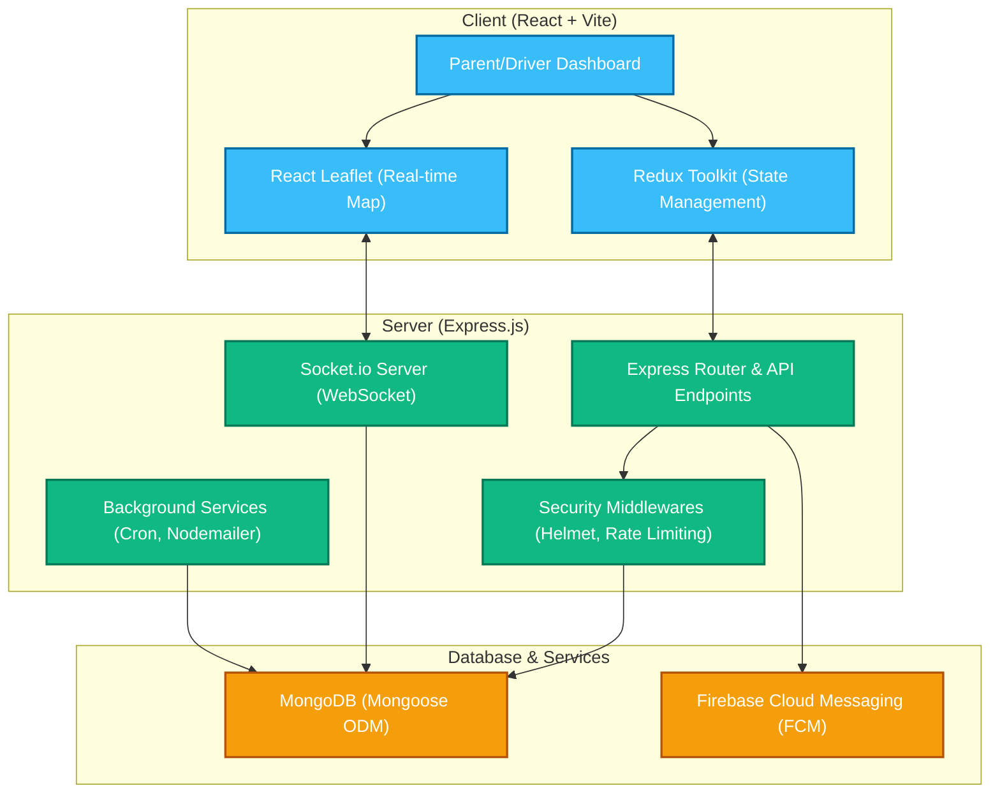

# 🏫 SchoolRide

[](https://nodejs.org/)
[](https://react.dev/)
[](https://tailwindcss.com/)
[](https://www.mongodb.com/)
[](https://opensource.org/licenses/ISC)

**SchoolRide** is a modern, real-time school ride-sharing and booking platform. It connects parents looking for safe transportation for their school-going children with verified drivers. The system supports role-based dashboards, real-time map tracking, push notifications, and detailed trip routing.

---

## 🗺️ System Architecture



---

## ✨ Features

### 👤 Role-Based Dashboards
*   **Parent Dashboard**: Search for available school routes, request bookings, track active rides in real time, view children's trip status, and update profile options.
*   **Driver Dashboard**: Manage vehicles, register seats limits, start/end school trips, navigate routes via Leaflet maps, accept/reject parent bookings, and broadcast real-time locations.
*   **Admin Dashboard**: Monitor all active bookings, routes, user statuses, and resolve system issues.

### 📍 Real-Time Location & Tracking
*   Interactive maps using **React Leaflet**.
*   Real-time driver location tracking broadcasted to parents using **Socket.io**.
*   Interactive starting/destination point mapping for routes.

### 🔒 Security & Optimization
*   Secure authentication using **JSON Web Tokens (JWT)** and **bcryptjs** hashing.
*   HTTP security headers powered by **Helmet**.
*   API request throttling using **Express Rate Limiter**.
*   Data sanitization and structured schemas verified through **Joi Validation**.

### 🔔 Notifications & Email Service
*   Push Notifications via **Firebase Cloud Messaging (FCM)** for immediate updates.
*   Email updates (Verification OTPs, Welcoming, Password Resets) via **Nodemailer** using HTML email templates.

---

## 🛠️ Technology Stack

### Frontend (Client)
*   **Core Framework:** React 19 (Vite)
*   **State Management:** Redux Toolkit & React-Redux
*   **Styling:** Tailwind CSS v4 (using `@tailwindcss/vite` compiler)
*   **Routing:** React Router DOM v7
*   **Maps & Tracking:** Leaflet & React-Leaflet
*   **Forms:** React Hook Form
*   **HTTP Client:** Axios

### Backend (Server)
*   **Runtime Environment:** Node.js (v20+)
*   **Server Framework:** Express 5.x
*   **Database:** MongoDB with Mongoose ODM
*   **WebSockets:** Socket.io
*   **Authentication:** JWT (jsonwebtoken) & bcryptjs
*   **Validation:** Joi
*   **Security:** Helmet & Express Rate Limit
*   **Testing:** Native Node.js test runner (`node:test`)

---

## 🚀 Getting Started

### Prerequisites
*   [Node.js](https://nodejs.org/) (v20 or higher recommended)
*   [MongoDB](https://www.mongodb.com/try/download/community) installed and running locally on port `27017`

### Setup Instructions

1.  **Clone the Repository**
    ```bash
    git clone https://github.com/your-username/SchoolRide.git
    cd SchoolRide
    ```

2.  **Configure Environment Variables**

    *   **Client Configuration**
        Create a `.env` file in the `Client/` folder:
        ```env
        VITE_API_BASE_URL=/api
        ```

    *   **Server Configuration**
        Create a `.env` file in the `Server/` folder:
        ```env
        PORT=5000
        MONGODB_URL=mongodb://127.0.0.1:27017/schoolride
        JWT_SECRET=your_super_secret_jwt_key_at_least_256_bits
        NODE_ENV=development

        # Optional Email Configuration (smtp-relay)
        SMTP_USER=your_smtp_user
        SMTP_PASS=your_smtp_password
        SENDER_EMAIL=noreply@schoolride.com

        # Optional Firebase Configuration (for Push Notifications)
        FIREBASE_PROJECT_ID=your_firebase_project_id
        FIREBASE_CLIENT_EMAIL=your_firebase_client_email
        FIREBASE_PRIVATE_KEY=your_firebase_private_key
        ```

3.  **Install Dependencies**

    *   **For the Server:**
        ```bash
        cd Server
        npm install
        ```

    *   **For the Client:**
        ```bash
        cd ../Client
        npm install
        ```

---

## 🏃 Running the Application

### Starting in Development Mode

To run both services simultaneously, run the dev script inside each directory:

1.  **Start the Backend Server (Server)**
    ```bash
    cd Server
    npm run dev
    ```
    This launches the backend using `nodemon` on **http://localhost:5000** (API docs available at **http://localhost:5000/api-docs**).

2.  **Start the Frontend App (Client)**
    ```bash
    cd Client
    npm run dev
    ```
    This launches the Vite development server on **http://localhost:5173** (automatically proxies `/api` calls to the backend).

---

## 🧪 Testing

### Server Test Suite
The Server contains comprehensive unit tests for controllers and models using the native Node.js test runner (`node:test`).

*   To run the tests:
    ```bash
    cd Server
    npm test
    ```

### Virtual Endpoint Testing
The test suite includes a virtual testing tool (`tests/virtual.test.js`) that simulates client-side fetch requests to verify active API routes and map controllers.

---

## 📖 API Documentation

API documentation is generated dynamically via **Swagger**. Once the backend server is running, visit:
👉 **[http://localhost:5000/api-docs](http://localhost:5000/api-docs)**

Key API routes:
*   `POST /api/auth/register` - Create user accounts (role: parent/driver)
*   `POST /api/auth/login` - Authenticate and establish session cookies
*   `POST /api/vehicle` - Create vehicle listings (seats availability, license details)
*   `GET /api/routes` - Retrieve routes mapping
*   `POST /api/trips` - Create and schedule active trips
*   `POST /api/location` - Broadcast driver coordinate coordinates